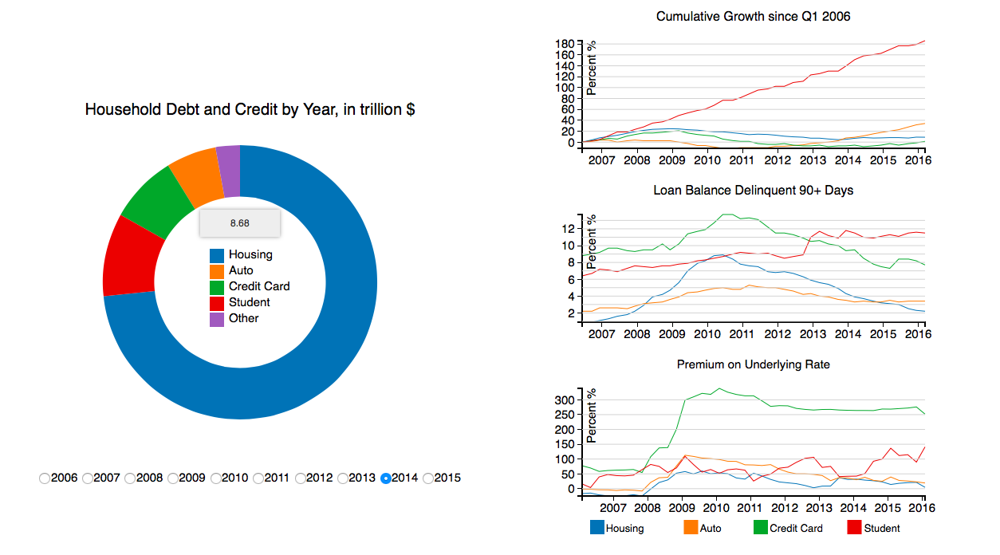

# Data Visualization Final

We wanted to better understand the student debt crisis in the US by analyzing and visualizing its data.

## Data
* [The Center for Microeconomic Data](https://www.newyorkfed.org/microeconomics/databank.html)

## Built With

* [D3](https://github.com/d3/d3) - Javascript Visualization Library
* HTML
* CSS

## Contributors

* **Henrik Nyhus**
